<!--
  ╔══════════════════════════════════════════════════════════════╗
  ║       RAFAEL EDUARDO — GitHub Profile · v2026.07             ║
  ║       Conceito: Ledger (registro operacional)                ║
  ╚══════════════════════════════════════════════════════════════╝
-->

<div align="center">



</div>

<br>

<div align="center">

[](https://rafaelanalyst.com.br)

</div>

<br>

---

## `01` &nbsp; Sobre

Desenvolvo e mantenho **sistemas web, sites e automações** para empresas que ainda dependem de planilha manual e processo por mensagem.

Vim do backoffice. Passei pela operação de consórcio, e é por isso que os sistemas que eu construo resolvem o problema certo: já fui a pessoa que sofria com ele.

Hoje sou **Analista de Inteligência Operacional** e, em paralelo, desenvolvedor freelancer.

<br>

---

## `02` &nbsp; Onde o código mora

Meus projetos estão em produção com **usuário real**, em clientes reais, e por isso os repositórios são privados. Prefiro construir coisa que roda a manter portfólio público de código bonito que ninguém usa.

Para ver os projetos com detalhe, o site tem tudo:

<br>

<div align="center">

[](https://rafaelanalyst.com.br)
[](https://linkedin.com/in/rafaeleduardo-analyst)
[](mailto:contato@rafaelanalyst.com.br)

</div>

<br>

---

## `03` &nbsp; Stack

<table>
<tr>
<td valign="top" width="50%">

**Desenvolvimento**
```
PHP        · aplicações com painel admin
JavaScript · front-end interativo
React      · SPA e componentes
Node.js    · serverless e integrações
```

**Dados**
```
SQL        · análise e regra de negócio
MySQL      · bancos relacionais
PostgreSQL · com Row Level Security
Power BI   · dashboards operacionais
```

</td>
<td valign="top" width="50%">

**Automação**
```
Apps Script · Google Workspace
Make        · fluxos visuais
n8n         · self-hosted
APIs REST   · com log e retry
```

**Infra e segurança**
```
Supabase  · auth e banco gerenciado
Netlify   · sites e functions
Hostinger · deploy via Git
RLS       · isolamento por usuário
```

</td>
</tr>
</table>

<br>

---

## `04` &nbsp; Como eu trabalho

<table>
<tr>
<td width="60" valign="top" align="center">

`01`

</td>
<td>

**Entendo antes de mexer.** Em código de terceiro, a primeira coisa que verifico é se tem credencial exposta. Só depois disso eu começo.

</td>
</tr>
<tr>
<td width="60" valign="top" align="center">

`02`

</td>
<td>

**Procuro o caso que quebra.** Toda regra de negócio tem exceção, e é ela que derruba a automação três semanas depois da entrega. Eu pergunto por ela antes de construir.

</td>
</tr>
<tr>
<td width="60" valign="top" align="center">

`03`

</td>
<td>

**Entrego em fatia, não em bloco.** Você vê algo funcionando na primeira semana. Não sumo por um mês para reaparecer com um sistema inteiro que talvez não seja o que você queria.

</td>
</tr>
<tr>
<td width="60" valign="top" align="center">

`04`

</td>
<td>

**Entrego e continuo respondendo.** Sai com documentação de manutenção, log de execução e o código no seu domínio. Você não fica refém de mim, e também não fica sozinho.

</td>
</tr>
</table>

<br>

---

## `05` &nbsp; Registro de atividade

<div align="center">

[](https://github.com/RafaelEdrd)

</div>

<br>

---

<div align="center">

<sub>

`RRE.` &nbsp; · &nbsp; registro operacional &nbsp; · &nbsp; 2026 &nbsp; · &nbsp; [rafaelanalyst.com.br](https://rafaelanalyst.com.br)

</sub>

</div>
